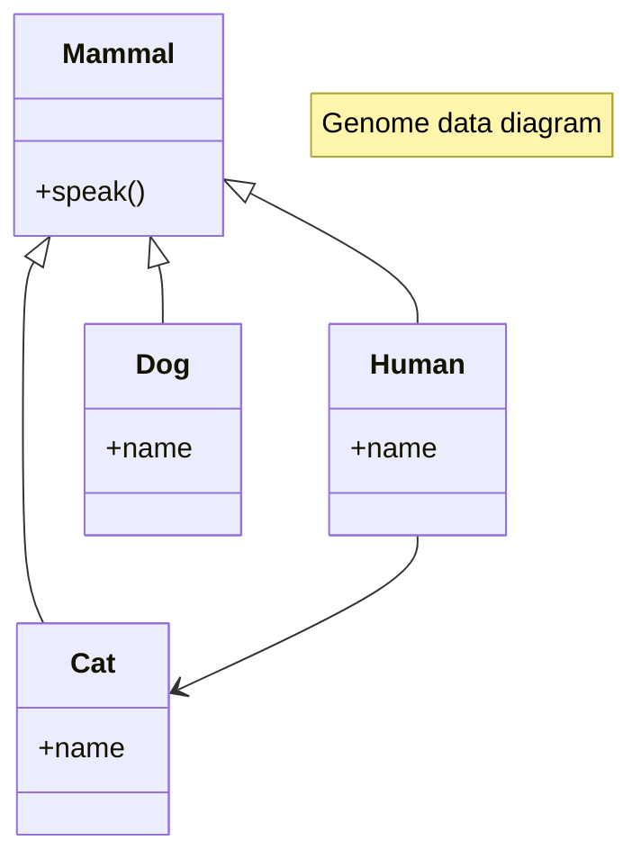

# Architecture

```mermaid

classDiagram
  note "Genome data diagram"
  class Human {
    +name
  }
  class Dog {
    +name
  }
  class Cat {
    +name
  }
  class Mammal {
    +speak()
  }
  Mammal <|-- Dog
  Mammal <|-- Human
  Mammal <|-- Cat
  Human --> Cat

```
